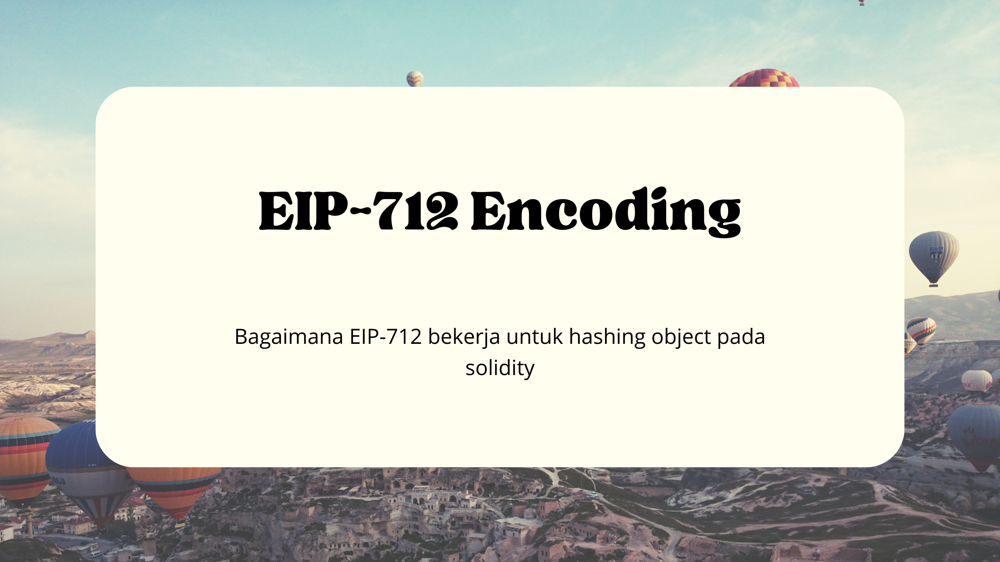

## Kenapa Hashing EIP-712
[EIP-712](https://eips.ethereum.org/EIPS/eip-712) adalah standar untuk melakukan hashing dan signing untuk sebuah struktur object. Pada database seperti mysql biasanya kita menggunakan id integer autoincrement atau uuid pada setiap record yang tersimpan. Namun smart contract memiliki keterbatasan penyimpanan dan assign id manual untuk setiap record yang tersimpan akan menghabiskan banyak gas fee. Jadi kali ini kita akan membahas bagaimana hashing EIP-712 dapat digunakan sebagai id untuk record yang tersimpan.

## Single Struct
### Solidity
Hal pertama yang perlu dilakukan adalah membuat struct di solidity

```solidity
struct Offer {
  address owner;
  string name;
  uint256 price;
}
```

Kemudian membuat typehash. Typehash single object dibuat dengan cara hashing representasi type dari struct. Berikut adalah representasi type dari struct tersebut

```
'Offer(address owner,string name,uint256 price)'
```
>
> Jangan menambahkan spasi pada type
>

Kemudian di-hash menggunakan fungsi `keccak256()`

```solidity
bytes32 constant OFFER_TYPEHASH = keccak256("Offer(address owner,string name,uint256 price)")
```

Kemudian lakukan encoding pada value yang akan di-hash

```solidity
function hashOffer(Offer memory offer) internal pure returns(bytes32) {
  bytes memory encoded = abi.encode(
    OFFER_TYPEHASH,
    offer.owner,
    keccak256(offer.name),
    offer.price
  )

  return keccak256(encoded);
}
```

Proses encoding dilakukan menggunakan fungsi [abi.encode()](https://medium.com/@scourgedev/deep-dive-into-abi-encode-types-padding-and-disassembly-84472f1b4543). Hal yang di-encode adalah typehash, kemudian data sesuai urutan pada struct. Untuk data dengan type string harus dilakukan hashing terlebih dahulu. `abi.encode()` akan menghasilkan data `bytes` yang artinya panjangnya dynamic. Setelah di-encode, lakukan hashing dari bytes hasil encode sehingga menghasilkan hash untuk object `Offer`

### Javascript
Untuk melakukan verifikasi off-chain, kita juga perlu melakukan hal yang sama pada bahasa pemrograman yang beriteraksi dengan blockhain. Umumnya bahasa yang digunakan adalah javascript dengan library [ethers](https://docs.ethers.org/v6/)

Hal pertama adalah membuat typehash. Typehash tetap menggunakan representasi yang sama yang digunakan sebelumnya

```
'Offer(address owner,string name,uint256 price)'
```

```javascript
import ethers from 'ethers'

const typehash = ethers.keccak256('Offer(address owner,string name,uint256 price)')
```

Kemudian hash object.

```javascript
import ethers from 'ethers'

const offer = {
  owner: '0x16f750B6bb0eeF814358773197812f2989efEEe2',
  name: 'Water Bottle',
  price: 1000
}

const hashedName = keccak256(Buffer.from(offer.name))

const coder = ethers.AbiCoder.defaultAbiCoder();
const encoded = coder.encode(
  ['bytes32', 'address', 'bytes32', 'uint256'],
  [typehash, offer.owner, hashedName, offer.price]
)

const hash = ethers.keccak256(Buffer.from(encoded.slice(2), 'hex'))
```
Untuk data string, perlu untuk di-hash terlebih dahulu. `coder.encode()` memerlukan 2 parameter yaitu array of type dan array of value. Karena encode menghasilkan string hex, maka perlu sebelum di-hash, '0x' diawal perlu dihilangkan dan `'hex'` param pada `Buffer.from` sebagai tanda bahwa string yang akan diubah menjadi buffer tersebut sudah berformat hex.

## Nested Struct
### Solidity
Sama seperti sebelumnya, buat struct solidity

```solidity
struct Seller {
  address owner;
  string productName;
}

struct Buyer {
  address owner;
  uint256 price
}

struct Trade {
  Seller seller;
  Buyer buyer;
  uint256 timestamp;
}
```

Kemudian membuat typehash. Typehash pada nested object harus mencantumkan semua representasi type dan diurutkan sesuai abjad. Berikut adalah representasi type dari nested struct tersebut.

```
'Trade(Seller seller,Buyer buyer,uint256 timestamp)Buyer(address owner,string productName)Seller(address owner,uint256 price)'
```

Kemudian di-hash menggunakan fungsi `keccak256()`

```solidity
bytes32 const TRADE_TYPEHASH = keccak256("Trade(Seller seller,Buyer buyer,uint256 timestamp)Buyer(address owner,uint256 price)Seller(address owner,string productName)")
```

Kemudian lakukan encoding pada value yang akan di-hash

```solidity
function hashTrade(Trade memory trade) internal pure returns(bytes32) {
  bytes memory sellerEncoded = abi.encode(
    keccak256("Seller(address owner,string productName)"),
    trade.seller.owner,
    keccak256(trade.seller.productName)
  )

  bytes memory buyerEncoded = abi.encode(
    keccak256("Buyer(address owner,uint256 price)"),
    trade.buyer.owner,
    trade.buyer.price
  )

  bytes memory tradeEncoded = abi.encode(
    TRADE_TYPEHASH,
    keccak256(sellerEncoded),
    keccak256(buyerEncoded),
    trade.timestamp
  )

  return keccak256(tradeEncoded)
}
```

Untuk nested object, lakukan encode dimulai dari object paling dasar. Kemudian hasil encode tersebut di-hash dan dimasukkan kedalam encode object yang lebih besar.

### Javascript
Untuk nested object, prosesnya hampir mirip dengan single object. Hal pertama adalah membuat typehash. Typehash tetap menggunakan representasi yang sama yang digunakan sebelumnya

```
'Trade(Seller seller,Buyer buyer,uint256 timestamp)Buyer(address owner,string productName)Seller(address owner,uint256 price)'
```

```javascript
import ethers from 'ethers'

const typehash = ethers.keccak256('Trade(Seller seller,Buyer buyer,uint256 timestamp)Buyer(address owner,string productName)Seller(address owner,uint256 price)')
```

Kemudian hash object

```javascript
import ethers from 'ethers'

const coder = ethers.AbiCoder.defaultAbiCoder()

const trade = {
  seller: {
    owner: '0x437C9Fe9c8C85Dd704541384528559D43590efB6',
    productName: 'Water Bottle'
  },
  buyer: {
    owner: '0x459f3A0143A5798d511E0A644655F43AE1abD2f9',
    price: 1000
  },
  timestamp: 17370835505
}

#Encode Seller
const sellerHashedProductName = ethers.keccak256(Buffer.from(trade.seller.productName))

const encodedSeller = coder.encode(
  ['address', 'bytes32'],
  [trade.seller.owner, sellerHashedProductName]
)
const hashedSeller = ethers.keccak256(Buffer.from(encodedSeller.slice(2), 'hex'))

#Encode Buyer
const encodedBuyer = coder.encode(
  ['address', 'uint256'],
  [trade.buyer.owner, trade.buyer.price]
)
const hashedBuyer = ethers.keccak256(Buffer.from(encodedBuyer.slice(2), 'hex'))

#Encode Trade
const encodedTrade = coder.encode(
  ['bytes32', 'bytes32', 'uint256']
  [hashedSeller, hashedBuyer, trade.timestamp]
)

const hash = ethers.keccak256(Buffer.from(encodedTrade.slice(2), 'hex'))
```

## Simpulan
Jadi hashing struct/object menggunakan standar EIP-712 dapat digunakan untuk generate unique id untuk struct record yang tersimpan pada smart contract sehingga bisa menghemat storage dan gas fee untuk mapping sebuah id dengan sebuah struct record