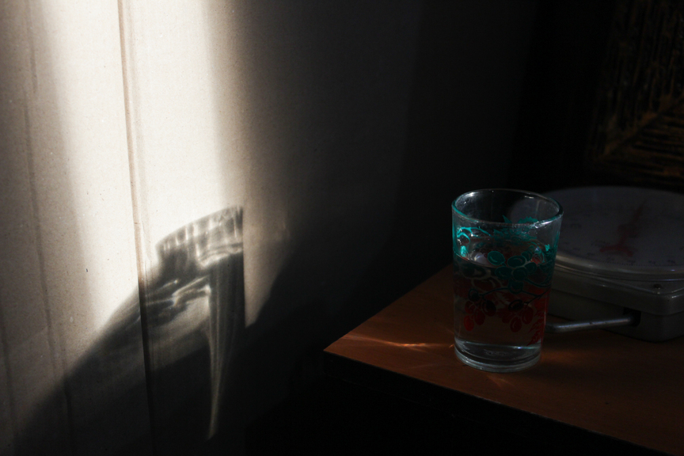

Halo gais, gimana kabarnya?

Jadi aku mau cerita kalo aku lagi mulai hobi baru buat tahun 2025 yaitu _Photography_. Sebenarnya aku udah ada interest sama fotografi dari tahun 2021 tapi saat itu belum ada budgetnya buat beli kamera. Sering browsing-browsing phone photography, ngulik basic photography kayak exposure, komposisi sama elemen visual. Tapi karena kamera hp seadanya jadinya males juga buat belajar terlalu serius haha.

Tahun lalu aku sering ikut event lari trus liat banyak banget orang yang motoin padahal itu bukan fotografer official dari penyelenggara event lari. Aku kulik dikit ternyata mereka fotografer fotoyu. Yang aku liat sih fotografer fotoyu itu bisa lebih fleksibel ya karena mereka fokus motoin orang trus upload ke fotoyu. Orang2 yang pengen beli foto mereka tinggal pilih sendiri dan bayar. Jadinya fotografer gak perlu repot2 buat jualan trus milih2 foto buat client

Karena dulu pernah belajar fotografi (sedikit), tertarik dengan fotoyu dan hype olahraga lari masih ada jadi aku memutuskan untuk membeli kamera pertamaku tahun ini. Karena budget juga terbatas jadinya aku memutuskan untuk membeli kamera canon 600D dengan lensa kit 18-55mm. Kamera ini memang kamera dslr lawas, tapi menurutku udah lebih dari cukup untuk aku latihan dan berkarya. Uhuyy

Aku udah sempet motret, ini hasilnya

Untuk hasil yang lebih lengkap ada di instagram [@moment.cekingx](https://www.instagram.com/moment.cekingx/)

Namun setelah aku punya kamera aku sadar kalo lensa kit itu tidak cocok untuk motoin orang lari karena focal length nya kurang tele alias kurang nge-zoom :). Jadi untuk sekarang aku mau belajar dulu biar setiap foto yang aku ambil itu punya exposure yang baik. Nggak under dan nggak over

See you next time,

Cheers