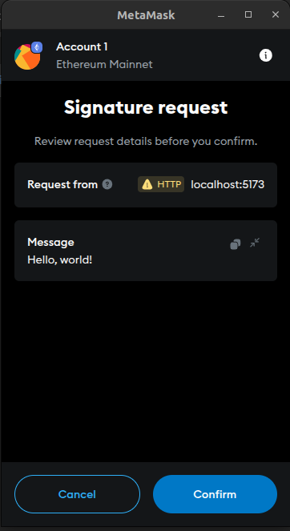
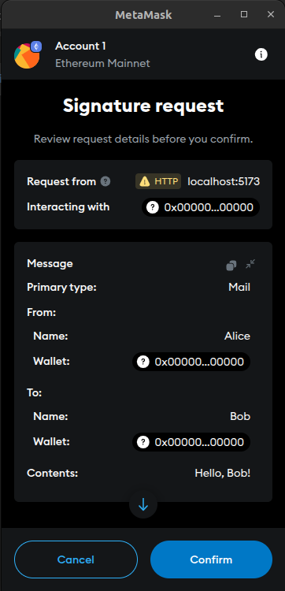

## Kenapa Message Signature
Setiap interaksi yang dilakukan kepada sebuah smart contract pasti memerlukan gas fee.
Untuk mengoptimalkan penggunaan gas fee pada user, setiap transaksi untuk melakukan persetujuan terhadap sesuatu bisa diubah menjadi Signed Message.
Dengan Signed Message maka seorang user dapat memberikan signature kepada sebuah pesan untuk diverifikasi oleh smart contract yang dituju.
Dengan hal seperti ini maka user yang melakukan persetujuan tidak perlu membayar gas fee.

## Signed Message
EIP-191 adalah bentuk sederhana dari Signed Message.
Strukturnya adalah

> `\x19Ethereum signed message:\n` + `len(message)` + `message`

Misalnya untuk message `Hello World`, panjang message tersebut adalah 11.
Maka message yang akan dihasilkan adalah `\x19Ethereum signed message:\n11Hello World`.
Kemudian message tersebut diberikan signature oleh user.



### Create Signature for String Message
Pada library ethers, method yang digunakan untuk memberikan signature adalah `signMessage()`.

```javascript
const message = "Hello, world!";
const signature = await user.signMessage(message)
const { v, r, s } = ethers.Signature.from(signature)
```
Nilai dari `v`, `r` dan `s` ini yang akan digunakan untuk verifikasi pada smart contract

### Verify String Message
```solidity
bytes memory prefixedMessage = abi.encodePacked(
  "\x19Ethereum Signed Message:\n",
  (bytes(value).length).toString(),
  "Hello, world!"
);

bytes32 digest = keccak256(prefixedMessage);

return ecrecover(digest, v, r, s);
```

### Create Signature for Bytes32 Message
Bytes32 message memiliki perlakukan khusus karena ethers memperlakukan string '0x1234' sebagai 6 karakter bukan 2 bytes

```javascript
const message = '0x9b74556d08a46ab198189741c71b554406488ebd87f958505c1fdaae9f6930dc';
const signature = await user.signMessage(Buffer.from(message.slice(2), 'hex'));
const { v, r, s } = ethers.Signature.from(signature);
```

### Verify Bytes32 Message
```solidity
bytes memory prefixedMessage = abi.encodePacked(
  "\x19Ethereum Signed Message:\n",
  "32",
  string(abi.encodePacked(0x9b74556d08a46ab198189741c71b554406488ebd87f958505c1fdaae9f6930dc))
)

bytes32 digest = keccak256(prefixedMessage);

return ecrecover(digest, v, r, s)
```

## Signed Typed Data
EIP-191 memiliki struktur yang sederhana, hanya terdiri dari sebuah string tanpa ada tambahan source of randomness seperti contract address maupun chainId.
Hal ini menyebabkan sebuah Signed Message bisa digunakan dimana saja sehingga hal ini tidak cocok untuk memberikan persetujuan hanya pada sebuah smart contract pada sebuah chainId.
EIP-712 memberikan struktur untuk memastikan bahwa sebuah message hanya bisa digunakan pada sebuah smart contract pada suatu chainId.
Strukturnya adalah

> `/x19/01` + `hashStruct(EIP712Domain)` + `hashStruct(message)`

EIP712Domain terdiri dari

```javascript
{
  name: string,
  version: string,
  chainId: number,
  verifyingContract: string,
}
```
Domain separator ini memastikan bahwa signature yang nanti dihasilkan hanya bisa digunakan pada sebuah smart contract dan tidak bisa digunakan pada smart contract yang lain.



### Create Signature
Pada library ethers, method yang digunakan untuk memberikan signature adalah `signTypedData()`.

```javascript
const signed = await user.signTypedData(
  {
    name: 'Ether Mail',
    version: '1',
    chainId: 1,
    verifyingContract: '0x388C818CA8B9251b393131C08a736A67ccB19297'
  },
  {
    User: [
      { name: 'name', type: 'string' },
      { name: 'wallet', type: 'address' }
    ],
    Mail: [
      { name: 'from', type: 'User' },
      { name: 'to', type: 'User' },
      { name: 'contents', type: 'string' }
    ]
  },
  {
    from: {
      name: 'Alice',
      wallet: '0x388C818CA8B9251b393131C08a736A67ccB19297'
    },
    to: {
      name: 'Bob',
      wallet: '0x388C818CA8B9251b393131C08a736A67ccB19297'
    },
    contents: 'Hello, Bob!'
  }

  const { v, r, s } = ethers.Signature.from(signed)
)
```

### Verify Signature
```solidity
struct EIP712Domain {
  string name;
  string version;
  uint256 chainId;
  address verifyingContract;
}

struct User {
  string name;
  address wallet;
}

struct Mail {
  User from;
  User to;
  string contents;
}

function EIP712DomainTypehash() public pure returns (bytes32) {
  return keccak256("EIP712Domain(string name,string version,uint256 chainId,address verifyingContract)");
}

function EIP712DomainValue() public view returns (EIP712Domain memory) {
  return EIP712Domain({
    name: "Ether Mail",
    version: "1",
    chainId: 31337,
    verifyingContract: address(this)
  });
}

function buildDomainHash() public view returns (bytes32) {
  return keccak256(abi.encode(
    EIP712DomainTypehash(),
    keccak256(bytes(EIP712DomainValue().name)),
    keccak256(bytes(EIP712DomainValue().version)),
    EIP712DomainValue().chainId,
    EIP712DomainValue().verifyingContract
  ));
}

function defaultDomainHash() public view returns (bytes32) {
  return _domainSeparatorV4();
}

function userTypehash() public pure returns (bytes32) {
  return keccak256("User(string name,address wallet)");
}

function userAliceValue() public pure returns (User memory) {
  return User({
    name: "Alice",
    wallet: 0xf39Fd6e51aad88F6F4ce6aB8827279cffFb92266
  });
}

function userAliceHash() public pure returns (bytes32) {
  return keccak256(abi.encode(
    userTypehash(),
    keccak256(bytes(userAliceValue().name)),
    userAliceValue().wallet
  ));
}

function userBobValue() public pure returns (User memory) {
  return User({
    name: "Bob",
    wallet: 0xf39Fd6e51aad88F6F4ce6aB8827279cffFb92266
  });
}

function userBobHash() public pure returns (bytes32) {
  return keccak256(abi.encode(
    userTypehash(),
    keccak256(bytes(userBobValue().name)),
    userBobValue().wallet
  ));
}

function mailTypehash() public pure returns (bytes32) {
  return keccak256("Mail(User from,User to,string contents)User(string name,address wallet)");
}

function mailValue() public pure returns (Mail memory) {
  return Mail({
    from: userAliceValue(),
    to: userBobValue(),
    contents: "Hello, Bob!"
  });
}

function mailHash() public pure returns (bytes32) {
  return keccak256(abi.encode(
    mailTypehash(),
    userAliceHash(),
    userBobHash(),
    keccak256(bytes(mailValue().contents))
  ));
}

function recoverMail(uint8 v, bytes32 r, bytes32 s) public view returns(address) {
  bytes32 hash = keccak256(abi.encodePacked(
    "\x19\x01",
    buildDomainHash(),
    mailHash()
  ));

  return ecrecover(hash, v, r, s)
}
```

Jadi setiap jenis message signature memiliki kelebihannya masing-masing.
EIP-191 memiliki struktur yang simple sehingga mudah untuk dimengerti dan dimodifikasi sesuai dengan kebutuhan.
EIP-712 menawarkan jaminan bahwa sebuah signature hanya bisa digunakan pada satu tempat.

Semoga bermanfaat :)

Cheers.

## Related

- [Smart Contract](https://github.com/cekingx/blog-content-ethereum-message-sign)
- [UI](https://github.com/cekingx/blog-content-ethereum-message-sign-ui)